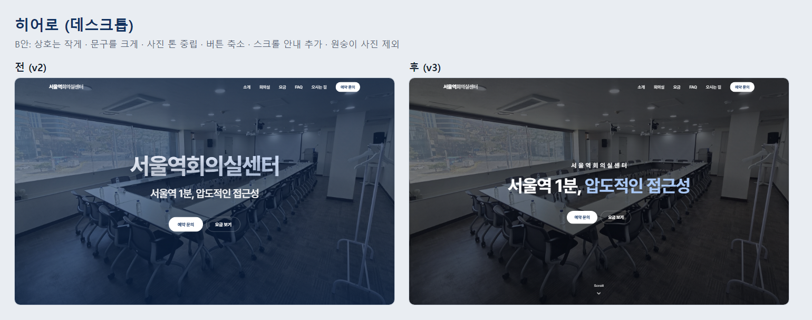

# 서울역회의실센터 홈페이지

서울역 앞에서 회의실 대여업을 하는 가족 사업체의 공식 홈페이지를 **기획부터 배포·운영·데이터 분석까지** 직접 진행한 프로젝트입니다.

**사이트**: [서울역회의실센터.kr](https://서울역회의실센터.kr)



---

## 한눈에 보기

| 항목 | 내용 |
|---|---|
| 기간 | 2026년 9월 (시안 반복 후 실제 제작·운영) |
| 역할 | 1인 진행: 요구사항 정리, 제작, 배포, 도메인 연결, 검색 등록, 데이터 분석 |
| 목표 | 검색이나 지도에서 들어온 방문자가 위치·시설·요금을 확인하고 **바로 전화·문자·네이버 예약으로 문의**하게 만들기 |
| 기술 | HTML / CSS / JavaScript (프레임워크·빌드 도구 없음) |
| 운영 | Netlify 호스팅, 가비아 도메인(.kr 한글 도메인), Google Analytics 4, Google Search Console, 네이버 서치어드바이저 |
| 도구 | AI 코딩 도구 Claude Code를 활용해 구현하고, 기획·결정·검수는 직접 진행 |

---

## 한 일

### 1. 기획과 요구사항 정리
- 사업주와 여러 차례 시안을 주고받으며 확정된 사항(요금 정책, 문구, 디자인 방향)을 문서로 정리하고 그대로 반영
- 요금이 **호실이 아닌 인원 기준**이라는 운영 방식에 맞춰, 요금표와 후기 표기에서 호실 번호를 빼는 등 화면 전체를 일관되게 정리

### 2. 제작
- 한 페이지 구성: 히어로 → 핵심 숫자 → 소개 → 시설 → 공간 → 요금 → 후기 → FAQ → 오시는 길 → 문의
- **예상 요금 계산기**: 인원과 시간을 고르면 요금표 데이터를 읽어 바로 계산 (요금이 바뀌어도 표만 고치면 됨)
- **예약 방법 선택 창**: 모든 '예약 문의' 버튼에서 네이버 예약·전화·문자 중 하나를 고르게 함
- 반응형(데스크톱·모바일), 키보드 사용, 움직임 줄이기 설정 대응
- 실제 네이버 플레이스 후기로 예시 문구 교체

### 3. 배포와 도메인
- Netlify로 정적 사이트 배포, 사업자 명의로 한글 도메인 `서울역회의실센터.kr` 구매
- DNS에 A 레코드와 CNAME(www)을 직접 설정해 도메인과 호스팅 연결, HTTPS 자동 적용

### 4. 검색 노출
- Google Search Console과 네이버 서치어드바이저에 사이트 등록, 수집 요청
- `sitemap.xml`, `robots.txt`, 구조화 데이터(LocalBusiness, WebSite), 파비콘 추가
- 공개 약 1주 만에 구글 검색 결과에 노출

### 5. 데이터 측정과 개선
- GA4 연동. **실제 도메인에서만** 기록되게 해 테스트 방문이 통계에 섞이지 않도록 함
- 문의 버튼 클릭(전화·문자·네이버 예약)과 **섹션별 도달**을 이벤트로 측정해, 방문자가 어디까지 보고 어디서 문의하는지 확인
- 첫 4주 데이터(9/1~9/28): 방문자 120명, 세션 157회
  - 가장 큰 실제 유입은 **네이버 플레이스(37회)**, 다음이 **검색(35회)** → 지도·플레이스 연동이 홈페이지보다 중요한 채널임을 확인

### 6. 디자인 개선 (v3)
실제 사용자 피드백을 받아 개선했습니다. 변경 전후 비교는 [`docs/`](docs/)에 있습니다.

| 개선 | 이유 |
|---|---|
| 히어로: 상호는 작게, "서울역 1분, 압도적인 접근성"을 크게 | 상호가 너무 크고 투박해 보인다는 피드백. 가장 큰 강점인 위치를 먼저 보이게 함 |
| 모바일 히어로에 스크롤 안내 추가 | 첫 화면이 꽉 차서 아래 내용이 있는지 모르는 방문자가 있었음 |
| 문의 섹션에 예약 방법 3가지를 바로 노출 | 버튼을 한 번 덜 눌러도 문의할 수 있게 |
| 모바일 요금 계산기 빈 공간 수정 | 전후 비교 중 발견한 레이아웃 버그 |

---

## 구조

```
├─ index.html        # 페이지 전체
├─ css/style.css     # 디자인 (색상 변수는 맨 위 :root)
├─ js/main.js        # 메뉴, 스크롤 효과, 요금 계산기, 예약 선택 창, GA 이벤트 측정
├─ js/kakao-map.js   # 카카오맵이 안 뜰 때 대체 안내
├─ images/           # 회의실 사진
├─ sitemap.xml, robots.txt
└─ docs/             # 변경 전후 비교 캡처 (README용)
```

## 로컬에서 보기

카카오맵은 `file://`로 열면 뜨지 않아 서버로 열어야 합니다.

```bash
python -m http.server 8080
```

브라우저에서 http://localhost:8080 에 접속합니다. 로컬에서는 애널리틱스가 기록되지 않습니다.

## 배운 점

- 홈페이지 자체보다 **네이버 플레이스·지도 같은 채널 연동**이 실제 유입에 더 큰 영향을 줬습니다.
- "평균 머문 시간" 같은 일반 지표보다, 사업 목표(문의)에 맞는 **이벤트를 직접 정의해 측정**해야 사이트 효과를 판단할 수 있었습니다.
- 개선은 사업주가 좋아한 기존 요소를 유지하면서 필요한 부분만 바꾸는 것이 중요했습니다. 한 번에 많이 바꾼 시안은 반려됐고, 이후에는 계획을 먼저 공유하고 승인받은 뒤 진행했습니다.
